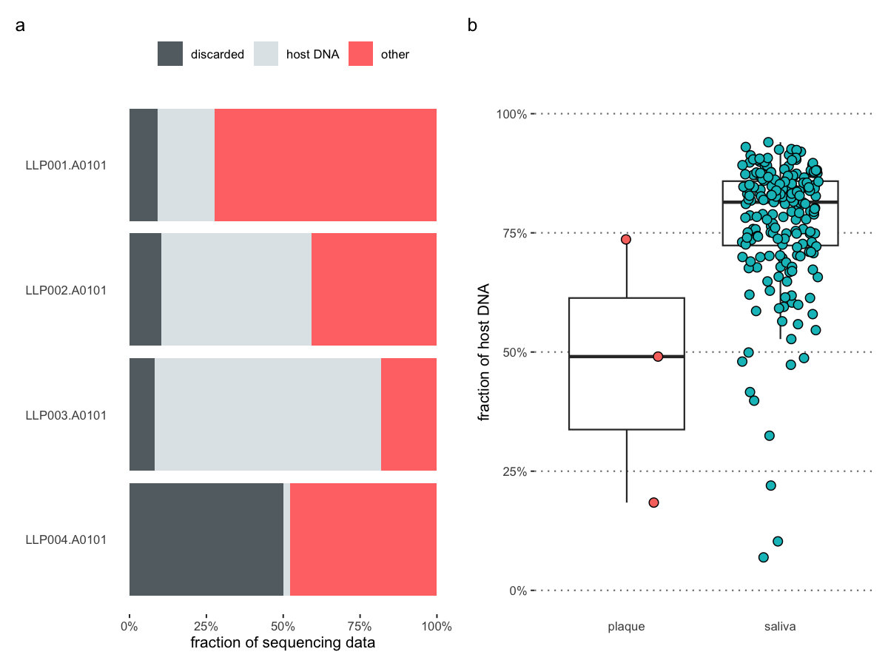
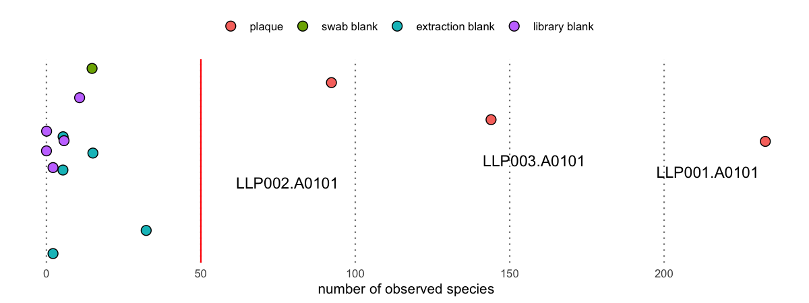
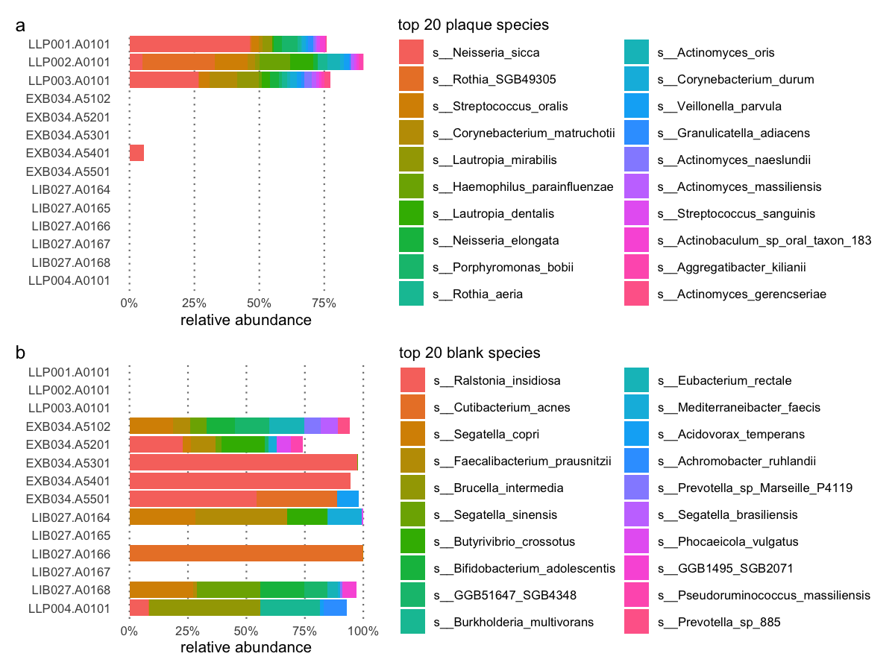
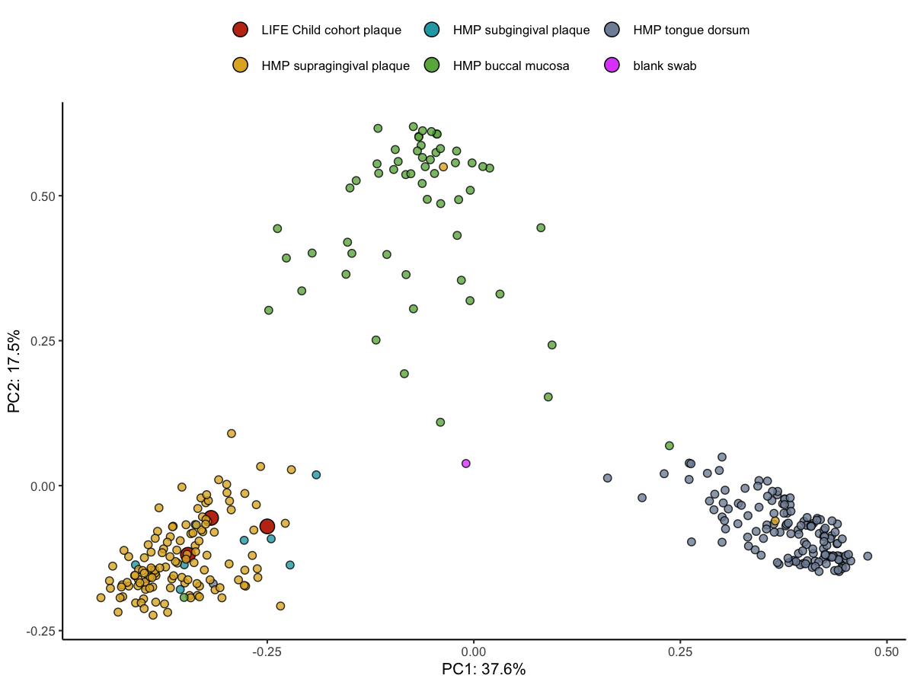

Summary of the LIFE child cohort pilot study
================
Alex Huebner
Mar 04, 2025

- [Overview of the sequencing
  results](#overview-of-the-sequencing-results)
- [Analysis of the microbial DNA](#analysis-of-the-microbial-dna)
- [Strain sharing between
  individuals](#strain-sharing-between-individuals)
- [Conclusion](#conclusion)

This report summarises the results of the initial sequencing of three
supragingival plaque samples and an unused dental swab (**Table 1**).
The three plaque samples comprise a child from the LIFE child cohort
sample (LLP001.A) and a mother-child pair (LLP002.A and LLP003.A). The
second child is matched in age and sex with the child from the LIFE
child cohort.

**Table 1**: **Overview of the samples.**

| Pandora ID |  Sample ID   |           additional information           |
|:----------:|:------------:|:------------------------------------------:|
|  LLP001.A  | LC6QPY-ZB-01 |      child1, female, birth year: 2014      |
|  LLP002.A  | LC6GVP-ZB-01 | mother of child2, female, birth year: 1985 |
|  LLP003.A  | LC6GGK-ZB-01 |      child2, female, birth year: 2015      |
|  LLP004.A  |     LC4      |            empty sampling brush            |

All samples were extracted with the Qiagen PowerSoil kit and 250 ng of
DNA were sheared to a mean DNA molecule length of 500 bp prior to
building Illumina sequencing libraries using an in-house protocol for
double-stranded DNA. The samples were pooled and sequenced across eight
lanes of an Illumina NovaSeq X paired-end sequencing run with nominal
length of 2x 150 bp.

## Overview of the sequencing results

After the initial sequencing, adapter sequences were trimmed from the
sequencing data and the trimmed sequences were evaluated for their
quality. Low quality reads were discarded (**Figure 1a**), while the
remainder of the sequences were aligned against the telomere-to-telomere
assembly of the human reference genome, *T2T-CHM13v2.0*.

<!-- -->

**Figure 1**: **Overview of the origin of the sequencing data**. **a**
Fraction of reads that were either discarded due to low quality or were
identified as host DNA. **b** Comparison of the fraction of host DNA
between the plaque samples and saliva samples from individuals from the
Amazonas region in South America.

From the four samples, the blank dental swap (*LLP004.A0101*) had the
highest fraction of discarded sequences (**Figure 1a**). This is
expected because, due to its low biomass, a higher fraction of
sequencing artefacts, such as adapter dimers, is generated during the
library preparation. For the actual plaque samples, the fraction of
discarded sequences is about 10% - this order of magnitude is regularly
observed in other biological samples, too.

The amount of host DNA varied quite substantially across the plaque
samples spanning from 18% to 74% (**Figure 1a**). These values are quite
high compared to matured oral biofilm. However, when comparing these
samples against saliva samples from individuals from the Amazonas basin
in South America (**Figure 1b**), the plaque samples fell within the
lower end of the fraction of host DNA distribution of the saliva
samples. Only sample *LLP003.A0101* fell within the interquartile
distribution of the saliva samples indicating that this sample had a
particularly high proportion of host DNA.

As there is no ethical approval to study the host DNA, it would make
sense to think about laboratory strategies to reduce the fraction of
host DNA prior to building the sequencing libraries, e.g. by removing
the host DNA via a spin column. The amount of sequencing data available
for microbiome-related analyses was higher than 50 million sequences,
which is commonly found in other microbial studies, for two out of three
samples (**Table 2**).

**Table 2**: **Number of sequences available for microbial DNA
analyses.**

|    sample    | non-host sequences \[million\] |
|:------------:|:------------------------------:|
| LLP001.A0101 |             172.9              |
| LLP002.A0101 |              94.8              |
| LLP003.A0101 |              33.6              |

## Analysis of the microbial DNA

After discarding the host DNA, I inferred which microbial species are
present in the plaque samples and laboratory controls by taxonomically
profiling it with the program MetaPhlAn. MetaPhlAn uses a catalogue of
marker genes that are identified from many microbial species that are
present in human-associated microbiome samples. Because it uses a subset
of high-quality microbial genomes that are human-associated, it reduces
the risk for false positive and false negative species assignment and
returns accurate taxonomic profiles.

First, I investigated how many microbial species were present in each
sample (**Figure 2**).

<!-- -->

**Figure 2**: **The number of observed taxa inferred from MetaPhlAn
v4.**

Across the samples, the three plaque samples had by far the highest
number of observed species, while the blank samples had much lower
numbers (**Figure 2**). This is expected as blank samples should have a
low biomass compared to the true biological samples. Among the three
samples, the sample with the highest number of non-host DNA (**Figure
1a**), *LLP001.A0101*, also had the highest number of observed species,
however, this trend was not confirmed by the other two plaque samples.

Next to having a higher number of species, the most abundant species of
the plaque samples strongly differed from the species that were most
abundant in the blank samples (**Figure 3**). Only a single species,
*Neisseria sicca*, which was present in a single extraction blank
sample, was shared within the top 20 most abundant species between the
plaque samples and the blank samples (**Figure 3a**).

<!-- -->

**Figure 3**: **Overview of the top 20 most abundant species that were
either found in the plaque or the blank samples.**

The top 20 most abundant species in the plaque samples are strongly
dominated by species associated with human oral microbiome (**Figure
3a**). In contrast, the blank swab sample, *LLP004.A0101*, was dominated
by *Brucella intermedia* and *Burkholderia multivorans* (**Figure 3b**).
Neither species is associated with the human oral microbiome but have
been isolated as opportunistic pathogens, suggesting that these are
primarily found in the environment. For the remaining extraction and
library blank samples, some of these were contaminated with bacteria
associated with the human gut microbiome. As the plaque samples were
co-extracted alongside FTA cards containing human stool samples, this is
expected.

Although these results combined strongly support the plaque samples were
true oral microbiome samples, there is still the open question whether
our wet lab analysis protocols would have introduced a systematic bias
compared to the microbial profiles of published oral microbiome samples.
To answer this question, I compared the taxonomic profiles of the three
plaque samples and the empty swab to the profiles of the human oral
microbiome samples of the Human Microbiome Project (HMP; **Figure 4**).
I compared the plaque samples against four different sample types
available in the Human Microbiome Project: supragingival plaque,
subgingival plaque, buccal mucosa, and tongue dorsum.

<!-- -->

**Figure 4**: **Principal component analysis of the LIFE Child cohort
plaque samples with the HMP oral microbiome samples.** The underlying
dissimilarity metric is Bray-Curtis.

For the comparison, I performed a beta diversity analysis based on
Bray-Curtis dissimilarity. Each pair of samples is compared and their
difference in species composition is recorded. The matrix of pairwise
dissimilarity scores is then used as the input in a Principal Coordinate
Analysis (PCoA).

The three plaque samples clustered with the other supragingival and
subgingival plaque samples from the HMP, highlighting that our wet lab
protocol did not introduce a systematic bias. This cluster of plaque
samples was distinct from the cluster of buccal mucosa and the cluster
of tongue dorsum samples. The blank swab sample did not cluster with any
microbiome sample but fell in the origin of the PCoA plot.

In summary, this result highlighted that the applied wet lab protocols
did not introduce a systematic bias but that we generated high-quality
microbial sequencing data that allows us to compare the plaque samples
with each other but also with published oral microbiome samples.

## Strain sharing between individuals

Our sample set of three comprises a mother-child pair and one individual
child. Such a setup allows asking whether the strains observed in the
mother-child pair are genetically more closely to each other than they
are to the unrelated child? Previous work on strain sharing in the oral
microbiome has shown that although not very microbial species is
vertically transmitted, there is plenty of evidence for it.

The ability of detecting strain sharing is dependent on whether there
are sufficient amounts of genetic information in each sample. In the
case that we are not able to reconstruct the genome for one of the three
samples, then we are also not able to investigate the strain sharing
across the samples. Therefore, I calculated the median relative
abundance of all microbial species across the three plaque samples and
selected the top three species: *Neisseria sicca*, *Lautropia
mirabilis*, and *Streptococcus oralis*.

I downloaded the species representative genome for each species from
NCBI Genomes and aligned the short-read sequencing data of each sample
against the reference genomes. After the sequence alignment, I jointly
called genotypes across the three samples for each species using
freeBayes. I filtered the inferred genotypes and only kept them when the
genotype quality was greater than 30, there was genotype information for
all samples, and when the site had only two alleles (bi-allelic; **Table
3**).

**Table 3**: **The number of sites per species for which a pair of
samples share a variant.**

|   species    | LLP002 & LLP003 | LLP001 & LLP002 | LLP001 & LLP003 |
|:------------:|:---------------:|:---------------:|:---------------:|
|   N. sicca   |     16,478      |      5,359      |      4,421      |
| L. mirabilis |     21,390      |     18,181      |     26,170      |
|  S. oralis   |     11,408      |      9,055      |     16,307      |

This filtering scheme left me with between 43,053 and 80,817 variants
for each species. I grouped the variants in three bins dependent which
two samples shared a variant and were different from the third sample
(**Table 3**).

From the three species, we only observed an excess of shared variants
between the mother (LLP002) and her child (LLP003) for *N. sicca*. Here,
the pair shared three times more variants with each other than either of
them shared with the unrelated child (LLP001). In contrast, for the
species *L. mirabilis* and *S. oralis*, the two children shared many
more variants with each other than the mother-child pair. This
highlights the reported issues of vertical transmission of strains from
mother to their children and its stability through the lifetime of their
offspring.

## Conclusion

In this pilot experiment, we extracted DNA from three supragingival
plaque samples, converted it into sequencing libraries and sequenced
them deeply. After initial processing for sequence quality, we obtained
between 34 and 173 million microbial sequences for the plaque samples.
The huge variation across the plaque samples can be explained by the
difference in the fraction of host DNA, and it might be worth to
consider methods to reduce the amount of host DNA prior to the
sequencing.

Taxonomic profiling of the plaque samples showed that the plaque samples
had many more microbial species than the accompanying blanks and that
the species strongly differed between them. A comparison of taxonomic
profiles of the plaque samples to previously published human oral
microbiome samples from the Human Microbiome Project revealed that the
plaque samples clustered with other plaque samples distinctly from other
oral cavity samples, such as buccal mucosa or tongue dorsum. Therefore,
the applied wet lab protocols did not introduce a systematic bias
compared to previously published samples.

An initial investigation on whether strain sharing between the
mother-child pair was frequently observed revealed that only for one of
the three tested species, *N. sicca*, there was an excess of variants
shared between the mother-child pair. For the species *L. mirabilis* and
*S. oralis*, the two children shared more variants with each other than
the mother and her offspring.
